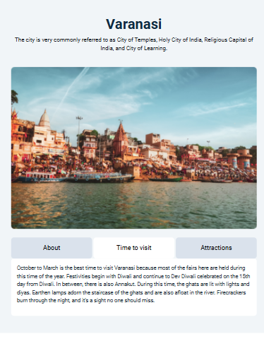

# Tab Navigation Script



This project provides an overview of Varanasi, including information about the city, the best time to visit, and its attractions. The content is displayed using a simple tabbed interface created with HTML, CSS, and JavaScript, along with Bootstrap for styling.

## Table of Contents

- [Getting Started](#getting-started)
- [Project Structure](#project-structure)
- [Features](#features)
- [Technologies Used](#technologies-used)
- [Usage](#usage)
- [JavaScript Functions](#JavaScript-Functions)
- [Styling](#Styling)
- [Contribution](#Contribution)

## Getting Started

To get a local copy up and running, follow these simple steps.

### Prerequisites

- A web browser
- An internet connection to load Bootstrap and other dependencies

### Installation

1. Clone the repo

   ```sh
   git clone https://github.com/Ganeshmoorthii/Tabs-templete.git


## Features

- **About Tab**: Provides a brief description of Varanasi.
- **Time to Visit Tab**: Suggests the best time to visit the city.
- **Attractions Tab**: Lists some of the main attractions in Varanasi.

## Technologies Used

- **HTML5**
- **CSS3**
- **JavaScript**
- **Bootstrap 4.5.2**

## Usage

Open `index.html` in your web browser. Click on the tabs to view different content sections.

### JavaScript Functions

- `aboutButtonEl.addEventListener('click', function() { ... })`: Switches to the "About" tab.
- `timeToVisitButtonEl.addEventListener('click', function() { ... })`: Switches to the "Time to Visit" tab.
- `attractionsButtonEl.addEventListener('click', function() { ... })`: Switches to the "Attractions" tab.

### Styling

- The project uses Bootstrap for basic styling.
- Custom styles can be added in the `styles.css` file located in the `assets/css` directory.


## Contribution

Contributions are what make the open-source community such an amazing place to learn, inspire, and create. Any contributions you make are **greatly appreciated**.

1. Fork the Project
2. Create your Feature Branch (`git checkout -b feature/AmazingFeature`)
3. Commit your Changes (`git commit -m 'Add some AmazingFeature'`)
4. Push to the Branch (`git push origin feature/AmazingFeature`)
5. Open a Pull Request

